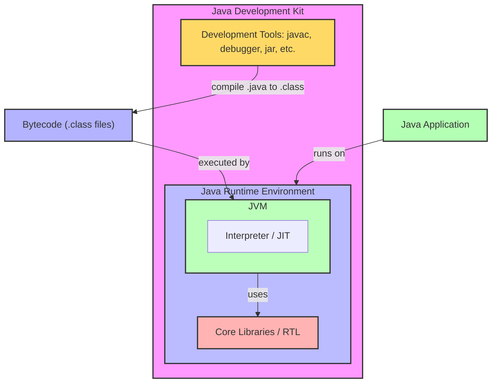
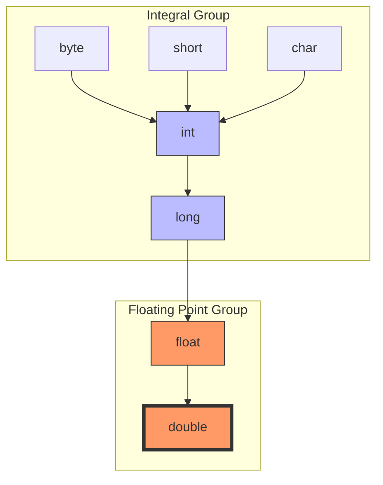

---

## Table of Contents
- [[#📌 What is Java]]
- [[#🧱 Java Architecture JVM JRE JDK]]
- [[#⚙️ How Java Works]]
- [[#✨ Features of Java]]
- [[#🖥️ Your First Java Program]]
- [[#📦 Basic Syntax Rules]]
- [[#🔢 Variables and Data Types]]
  - [[#Primitive Data Types (8 types)]]
  - [[#Why Multiple Sizes]]
  - [[#Literals]]
  - [[#Variable Declaration]]
- [[#📥 Basic Input (using Scanner)]]
- [[#📦 Packages]]
- [[#🔄 Type Conversion and Casting]]
  - [[#Widening (Implicit Casting)]]
  - [[#Narrowing (Explicit Casting)]]
  - [[#Automatic Type Promotion]]
  - [[#Type Promotion Rules]]
  - [[#Type Hierarchy Diagram]]
- [[#🧠 Memory Management Stack vs Heap]]
- [[#✅ Key Takeaways]]
- [[#📝 Practice Exercises]]
- [[#🔗 Additional Resources]]

---

## 📌 What is Java?

Java is a **high-level, object-oriented programming language** developed by Sun Microsystems (now owned by Oracle) in 1995. It is designed to be **platform-independent** at both the source and binary levels.

**Key Principle:** *"Write Once, Run Anywhere" (WORA)* – Java code compiled into bytecode can run on any device with a Java Virtual Machine (JVM).

---

## 🧱 Java Architecture: JVM, JRE, JDK



| Component | Full Form                | Purpose                                                                        |
| --------- | ------------------------ | ------------------------------------------------------------------------------ |
| **JVM**   | Java Virtual Machine     | Executes bytecode, provides runtime environment                                |
| **JRE**   | Java Runtime Environment | JVM + core libraries – needed to run Java programs                             |
| **JDK**   | Java Development Kit     | JRE + development tools (compiler, debugger) – needed to develop Java programs |

---

## ⚙️ How Java Works

1. Write source code (`.java` file)
2. Compile using `javac` → produces bytecode (`.class` file)
3. JVM executes bytecode (interprets or JIT compiles to machine code)

```text
Source Code (.java)  
    ↓ (javac compiler)  
Bytecode (.class)  
    ↓ (JVM)  
Machine Code (platform specific)
```

---

## ✨ Features of Java

- **Simple** – Easy to learn, syntax similar to C/C++ but removes complexity (no pointers, multiple inheritance, etc.)
- **Object-Oriented** – Everything (except primitives) is an object
- **Platform Independent** – Bytecode runs on any JVM
- **Secure** – No explicit pointers, bytecode verification, security manager
- **Robust** – Strong memory management, exception handling, type checking
- **Multithreaded** – Built-in support for concurrent programming
- **Portable** – Same bytecode works everywhere
- **High Performance** – Just-In-Time (JIT) compilation optimizes bytecode

---

## 🖥️ Your First Java Program

```java
// This is a simple Java program
public class HelloWorld {
    public static void main(String[] args) {
        System.out.println("Hello, World!");
    }
}
```

### Explanation:

- `public class HelloWorld` – Defines a class named `HelloWorld` (file must be named `HelloWorld.java`)
- `public static void main(String[] args)` – Entry point of any Java program
  - `public` – accessible from anywhere
  - `static` – called without creating an object
  - `void` – returns nothing
  - `main` – method name
  - `String[] args` – command-line arguments
- `System.out.println()` – Prints text to console

### Steps to Run:

1. Save file as `HelloWorld.java`
2. Open terminal in that directory
3. Compile: `javac HelloWorld.java` (creates `HelloWorld.class`)
4. Run: `java HelloWorld`

Output:
```
Hello, World!
```

---

## 📦 Basic Syntax Rules

- Java is **case-sensitive**
- Class names should start with uppercase (PascalCase)
- Method names start with lowercase (camelCase)
- File name must match public class name
- Every statement ends with semicolon `;`
- Code blocks are enclosed in curly braces `{}`

---

## 🔢 Variables and Data Types

### Primitive Data Types (8 types)

| Type      | Size    | Description                                | Example             |
|-----------|---------|--------------------------------------------|---------------------|
| `byte`    | 1 byte  | Integer (-128 to 127)                      | `byte b = 100;`     |
| `short`   | 2 bytes | Integer (-32,768 to 32,767)                | `short s = 5000;`   |
| `int`     | 4 bytes | Integer (-2^31 to 2^31-1)                  | `int i = 100000;`   |
| `long`    | 8 bytes | Integer (suffix L)                         | `long l = 100000L;` |
| `float`   | 4 bytes | Floating-point (suffix f)                  | `float f = 5.75f;`  |
| `double`  | 8 bytes | Double-precision floating                   | `double d = 19.99;` |
| `char`    | 2 bytes | Single character (Unicode)                 | `char c = 'A';`     |
| `boolean` | 1 bit   | `true` or `false`                          | `boolean flag = true;` |

### Why Multiple Sizes?

- **Memory efficiency** – Use `byte` for small numbers to save memory in large arrays.
- **Precision** – `float` is less precise; `double` is the default for floating‑point calculations because it offers higher precision.
- **Range** – `long` holds much larger integers than `int`; use it when values exceed `int` limits.

> [!QUESTION]  
> **"I can store decimal in float, then why use double?"**  
> Double provides more precision (15 digits vs. 7 for float) and is the default type for floating‑point literals in Java. Use `float` only when memory is critical or you are certain the extra precision is unnecessary.

> [!QUESTION]  
> **"I can store numbers in int, then why use long?"**  
> `int` max is ~2 billion. If you need to count beyond that (e.g., world population), `long` is necessary.

### Literals

A **literal** is the source code representation of a fixed value. Examples:
- Integer literals: `10`, `0xFF` (hex), `0b1010` (binary), `100L` (long)
- Floating‑point literals: `3.14`, `2.5f` (float), `1e-5` (double)
- Boolean literals: `true`, `false`
- Character literals: `'a'`, `'\n'` (escape sequences)
- String literals: `"Hello"`

> [!NOTE]  
> Java follows Unicode, so you can use characters from any language in `char` and `String`.

### Variable Declaration

```java
type variableName = value;

// Example
int age = 25;
double price = 99.99;
char grade = 'A';
boolean isPassed = true;
```

---

## 📥 Basic Input (using Scanner)

```java
import java.util.Scanner;  // import Scanner class

public class InputExample {
    public static void main(String[] args) {
        Scanner sc = new Scanner(System.in);  // create Scanner object
        
        System.out.print("Enter your name: ");
        String name = sc.nextLine();           // read string
        
        System.out.print("Enter your age: ");
        int age = sc.nextInt();                 // read integer
        
        System.out.println("Hello " + name + ", you are " + age + " years old.");
        
        sc.close();  // close scanner (optional but good practice)
    }
}
```

---

## 📦 Packages

**What is a package?**  
A package is a namespace that organizes a set of related classes and interfaces. Conceptually, it's like a folder in a file system. It provides:
- **Access protection** – Classes inside a package can have controlled visibility.
- **Name resolution** – Avoids naming conflicts.
- **Modularity** – Groups related code together.

**Why use packages?**
- To organize large projects.
- To reuse existing classes.
- To control access (e.g., package‑private visibility).

**Can we create our own package? How?**  
Yes. Use the `package` statement at the top of your Java file.

```java
package mypackage;

public class MyClass {
    // class body
}
```

To compile:  
`javac -d . MyClass.java`  
The `-d .` creates the directory structure matching the package name (`./mypackage/MyClass.class`).  
To run:  
`java mypackage.MyClass`

> [!TIP]  
> Package names are usually written in lowercase to avoid conflicts with class names.

---

## 🔄 Type Conversion and Casting

When assigning a value of one type to another, Java can either convert automatically (if safe) or require explicit casting.

### Widening (Implicit Casting)

- Converts a **smaller** type to a **larger** type.
- Safe, done automatically.

```java
int myInt = 500;
double myDouble = myInt;   // int → double, widening
System.out.println(myDouble); // 500.0
```

### Narrowing (Explicit Casting)

- Converts a **larger** type to a **smaller** type.
- Potential data loss; must be done manually using `(type)`.

```java
double price = 199.99;
int roundedPrice = (int) price;   // double → int, narrowing
System.out.println(roundedPrice); // 199 (truncated, not rounded)
```

### Automatic Type Promotion

In expressions, smaller types are promoted to the largest type involved.

```java
byte a = 40, b = 50, c = 100;
int result = a * b / c;   // a*b exceeds byte range → promoted to int
System.out.println(result); // 20
```

### Type Promotion Rules

1. All `byte`, `short`, and `char` values are promoted to `int` in arithmetic expressions.
2. If any operand is `long`, the whole expression is promoted to `long`; similarly for `float` → `float`, `double` → `double`.

```java
int i = 10;
float f = 2.5f;
double d = i * f;   // i promoted to float, result float, then assigned to double
System.out.println(d); // 25.0
```

### Type Hierarchy Diagram



**Direction of arrows:** smaller → larger (widening conversions allowed implicitly).

> [!CAUTION]  
> Narrowing conversions (against the arrow direction) require explicit casting and risk data loss.

---

## 🧠 Memory Management: Stack vs. Heap

- **Stack:** Stores local variables and **references** (addresses).
- **Heap:** Stores actual **objects** (data).

> [!IMPORTANT]
> - **Primitives** are stored directly in the stack (value copy on assignment).
> - **Objects** (including arrays) are stored in the heap; the stack holds the reference.
> - **Strings** are **immutable** objects stored in a special heap area called the **String Constant Pool**.

---

## ✅ Key Takeaways

- Java is platform-independent via bytecode and JVM.
- JDK = JRE + development tools; JRE = JVM + libraries.
- Every Java application needs a `main` method.
- Java has 8 primitive data types; choose the right type for memory and precision.
- Packages organize code and control access.
- Type conversion: widening (automatic, safe), narrowing (manual, risky), and promotion in expressions.
- Understand stack vs. heap for DSA interviews.
- Strings are immutable – use `StringBuilder` for heavy modifications.

---

## 📝 Practice Exercises

1. Write a program to print your name and address.
2. Write a program that takes two numbers as input and prints their sum.
3. Create variables of each primitive type and print their values.
4. Write a program to calculate simple interest (principal, rate, time as inputs).

---

## 🔗 Additional Resources

- [Official Java Documentation](https://docs.oracle.com/en/java/)
- [Java Tutorials by Oracle](https://docs.oracle.com/javase/tutorial/)

> 💡 **Tip:** Practice typing the code yourself – it helps you remember syntax!

---

**Next:** [[Flow of Program]] – Module 2