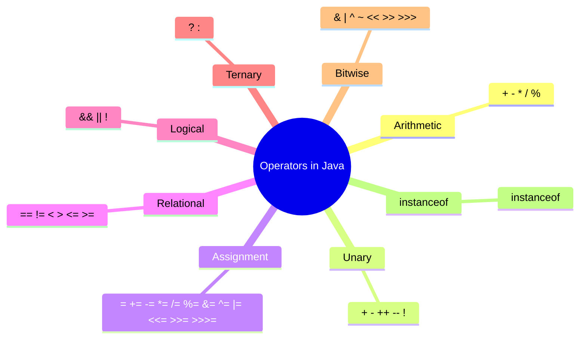

## Table of Contents

- [[#What are Operators]]
- [[#Classification of Operators]]
- [[#1. Arithmetic Operators]]
- [[#2. Unary Operators]]
- [[#3. Assignment Operators]]
- [[#4. Relational Operators]]
- [[#5. Logical Operators]]
- [[#6. Ternary (Conditional) Operator]]
- [[#7. Bitwise Operators]]
- [[#8. instanceof Operator]]
- [[#Operator Precedence and Associativity]]
- [[#Common Pitfalls & Tips]]
- [[#Practice Questions]]
- [[#Summary Table]]

---

## What are Operators?

Operators are special symbols that perform specific operations on one, two, or three operands and return a result. They are the building blocks of expressions in Java.

---

## Classification of Operators



**Diagram 1:** Overview of operator categories in Java.

---

## 1. Arithmetic Operators

Used to perform basic mathematical operations.

| Operator | Description          | Example        |
|----------|----------------------|----------------|
| `+`      | Addition             | `a + b`        |
| `-`      | Subtraction          | `a - b`        |
| `*`      | Multiplication       | `a * b`        |
| `/`      | Division             | `a / b`        |
| `%`      | Modulus (remainder)  | `a % b`        |

```java
int a = 10, b = 3;
System.out.println(a + b);   // 13
System.out.println(a - b);   // 7
System.out.println(a * b);   // 30
System.out.println(a / b);   // 3 (integer division)
System.out.println(a % b);   // 1
```

> [!NOTE]  
> For floating-point numbers, `/` performs normal division. Integer division truncates towards zero.

---

## 2. Unary Operators

Operate on a single operand.

| Operator | Description                  | Example     |
|----------|------------------------------|-------------|
| `+`      | Unary plus (indicates positive value) | `+a` |
| `-`      | Unary minus (negates value)  | `-a`        |
| `++`     | Increment by 1                | `a++` or `++a` |
| `--`     | Decrement by 1                | `a--` or `--a` |
| `!`      | Logical complement (inverts boolean) | `!flag` |

**Pre-increment vs Post-increment:**

```java
int x = 5;
int y = ++x;   // x becomes 6, y gets 6 (pre-increment)
int z = x--;   // z gets 6, then x becomes 5 (post-decrement)
```

> [!CAUTION]  
> Using `++` or `--` inside complex expressions can lead to unexpected results. Keep them standalone for clarity.

---

## 3. Assignment Operators

Assign values to variables. Compound assignments combine an operation with assignment.

| Operator | Description          | Equivalent to |
|----------|----------------------|---------------|
| `=`      | Simple assignment    | `a = b`       |
| `+=`     | Add and assign       | `a = a + b`   |
| `-=`     | Subtract and assign  | `a = a - b`   |
| `*=`     | Multiply and assign  | `a = a * b`   |
| `/=`     | Divide and assign    | `a = a / b`   |
| `%=`     | Modulus and assign   | `a = a % b`   |
| `&=`     | Bitwise AND and assign | `a = a & b`   |
| `|=`     | Bitwise OR and assign | `a = a | b`   |
| `^=`     | Bitwise XOR and assign | `a = a ^ b`   |
| `<<=`    | Left shift and assign | `a = a << b`  |
| `>>=`    | Right shift and assign | `a = a >> b`  |
| `>>>=`   | Unsigned right shift and assign | `a = a >>> b` |

```java
int a = 10;
a += 5;        // a = 15
a *= 2;        // a = 30
```

> [!TIP]  
> Compound assignments implicitly cast the result to the type of the left operand. E.g., `short s = 5; s += 10;` is allowed, but `s = s + 10;` would cause a compilation error (needs explicit cast).

---

## 4. Relational Operators

Compare two values and return a `boolean` result.

| Operator | Description                | Example   |
|----------|----------------------------|-----------|
| `==`     | Equal to                   | `a == b`  |
| `!=`     | Not equal to               | `a != b`  |
| `>`      | Greater than               | `a > b`   |
| `<`      | Less than                  | `a < b`   |
| `>=`     | Greater than or equal to   | `a >= b`  |
| `<=`     | Less than or equal to      | `a <= b`  |

```java
int a = 10, b = 5;
System.out.println(a > b);   // true
System.out.println(a == b);  // false
```

> [!CAUTION]  
> Do not confuse `=` (assignment) with `==` (equality). This is a common mistake that can lead to logical errors.

---

## 5. Logical Operators

Work with boolean operands and produce a boolean result.

| Operator | Description          | Example         |
|----------|----------------------|-----------------|
| `&&`     | Logical AND (short-circuit) | `(a > b) && (c < d)` |
| `||`     | Logical OR (short-circuit)  | `(a > b) || (c < d)` |
| `!`      | Logical NOT          | `!(a > b)`      |

**Short-circuiting:** In `&&`, if the left operand is `false`, the right is not evaluated. In `||`, if the left is `true`, the right is not evaluated.

```java
int x = 5, y = 0;
if (y != 0 && x / y > 1) {   // safe: y != 0 is false, so division never happens
    // ...
}
```

> [!TIP]  
| Use `&` and `|` for non-short-circuit logical operations (bitwise when applied to integers, logical when applied to booleans). They always evaluate both sides.

---

## 6. Ternary (Conditional) Operator

The only ternary operator in Java: `condition ? expression1 : expression2`

- If `condition` is `true`, evaluates to `expression1`, else to `expression2`.

```java
int a = 10, b = 20;
int max = (a > b) ? a : b;   // max = 20
```

> [!NOTE]  
> The two expressions must be compatible types. Often used for concise conditional assignments.

---

## 7. Bitwise Operators

Operate on individual bits of integer types (`byte`, `short`, `int`, `long`).

| Operator | Description               | Example       |
|----------|---------------------------|---------------|
| `&`      | Bitwise AND               | `a & b`       |
| `|`      | Bitwise OR                | `a | b`       |
| `^`      | Bitwise XOR               | `a ^ b`       |
| `~`      | Bitwise complement (unary) | `~a`         |
| `<<`     | Left shift                | `a << 2`      |
| `>>`     | Signed right shift        | `a >> 2`      |
| `>>>`    | Unsigned right shift      | `a >>> 2`     |

```java
int a = 5;   // binary: 0101
int b = 3;   // binary: 0011
System.out.println(a & b);   // 0001 → 1
System.out.println(a | b);   // 0111 → 7
System.out.println(a ^ b);   // 0110 → 6
System.out.println(~a);      // ...11111010 (two's complement) → -6
System.out.println(a << 1);  // 1010 → 10
```

> [!CAUTION]  
> Shifts on `byte`, `short`, `char` are promoted to `int` before shifting. The result is an `int`. Be careful with sign extension in right shifts (`>>` preserves sign, `>>>` fills with zero).

---

## 8. `instanceof` Operator

Checks whether an object is an instance of a specific class or interface.

```java
String str = "Hello";
if (str instanceof String) {
    System.out.println("str is a String");
}
```

- Returns `true` if the object is of the given type or a subtype.
- Returns `false` if the object is `null`.
- Commonly used before casting.

---

## Operator Precedence and Associativity

Operators have a defined precedence that determines the order of evaluation. Higher precedence operators are evaluated first.

| Precedence | Operator(s)                           | Associativity |
|------------|---------------------------------------|---------------|
| 1 (highest) | `++` `--` `+` `-` `~` `!` (unary)    | Right-to-left |
| 2           | `*` `/` `%`                           | Left-to-right |
| 3           | `+` `-`                                | Left-to-right |
| 4           | `<<` `>>` `>>>`                        | Left-to-right |
| 5           | `<` `>` `<=` `>=` `instanceof`         | Left-to-right |
| 6           | `==` `!=`                              | Left-to-right |
| 7           | `&` (bitwise AND)                      | Left-to-right |
| 8           | `^` (bitwise XOR)                      | Left-to-right |
| 9           | `|` (bitwise OR)                       | Left-to-right |
| 10          | `&&` (logical AND)                     | Left-to-right |
| 11          | `||` (logical OR)                      | Left-to-right |
| 12          | `? :` (ternary)                        | Right-to-left |
| 13          | `=` `+=` `-=` `*=` `/=` `%=` `&=` `|=` `^=` `<<=` `>>=` `>>>=` | Right-to-left |

> [!TIP]  
> When in doubt, use parentheses `()` to explicitly specify evaluation order. It improves code readability and avoids subtle bugs.

---

## Common Pitfalls & Tips

- **Integer Division:** `int / int` truncates; use at least one floating-point operand for decimal results.
- **Equality vs Assignment:** `if (x = 5)` compiles if `x` is boolean (assigns and then uses the assigned value), but often a mistake. For non-boolean, it's a compile error.
- **Short-circuiting:** Use `&&` and `||` to avoid evaluating expressions that may cause errors (like division by zero or null checks).
- **Bitwise vs Logical:** `&` and `|` can be used as both logical (non-short-circuit) and bitwise operators depending on operand types. Use with caution.
- **Increment in expressions:** `y = x++ + ++x;` is confusing and may give different results across languages. Avoid.

> [!QUESTION]  
> **What will be the output?**  
> ```java
> int i = 0;
> System.out.println(i++ + ++i);
> ```  
> **Answer:** `2` (first `i++` uses 0 then increments to 1, then `++i` increments to 2 and uses 2, sum = 2)

---

## Practice Questions

1. Evaluate: `10 + 3 * 2 / (4 - 2) % 3`
2. What is the value of `x` after `int x = 5; x += x++ + ++x;`?
3. Write a program using the ternary operator to find the largest of three numbers.
4. Explain the difference between `>>` and `>>>` with an example.
5. What happens when you apply `~` to a positive number?

---

## Summary Table

| Category       | Operators                                     |
|----------------|-----------------------------------------------|
| Arithmetic     | `+` `-` `*` `/` `%`                           |
| Unary          | `+` `-` `++` `--` `!`                          |
| Assignment     | `=` `+=` `-=` `*=` `/=` `%=` `&=` `|=` `^=` `<<=` `>>=` `>>>=` |
| Relational     | `==` `!=` `<` `>` `<=` `>=`                    |
| Logical        | `&&` `||` `!`                                  |
| Ternary        | `? :`                                          |
| Bitwise        | `&` `|` `^` `~` `<<` `>>` `>>>`                 |
| Type comparison| `instanceof`                                   |

---

> [!TIP]  
> Mastery of operators is fundamental for writing efficient and bug‑free Java code. Practice with small code snippets and edge cases.


---
Previous module : [[Flow of Program]]
Next module: [[Array in Java]]