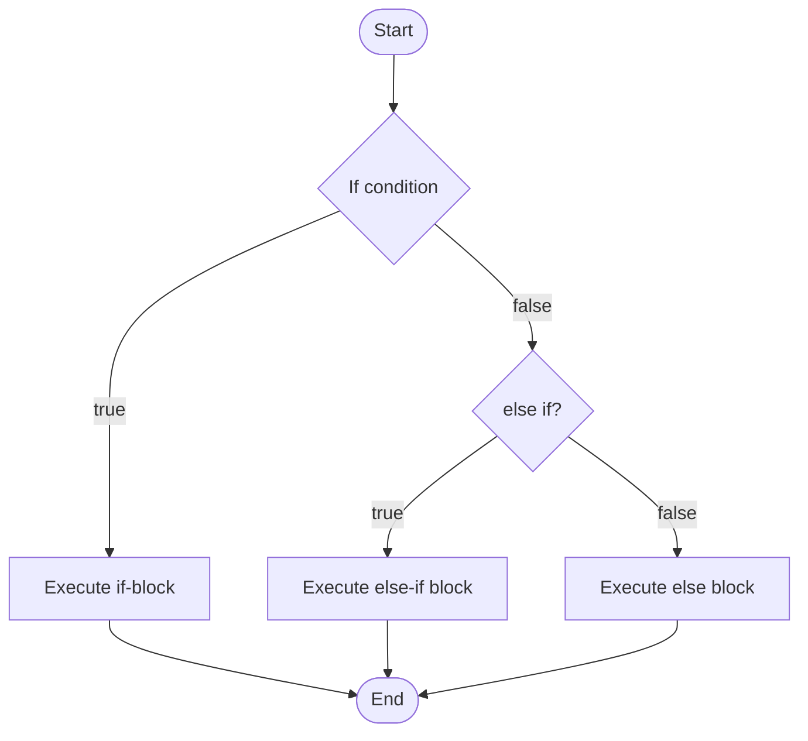
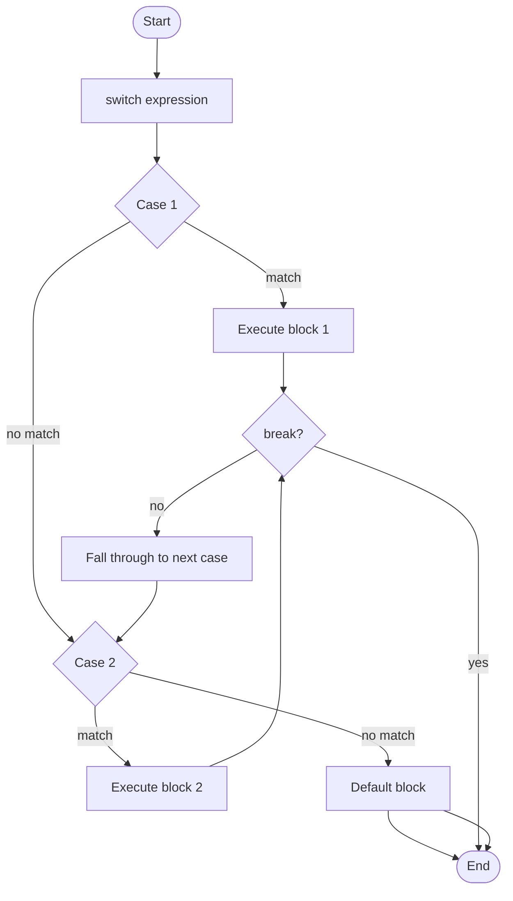
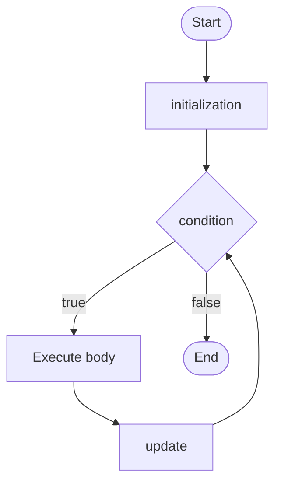
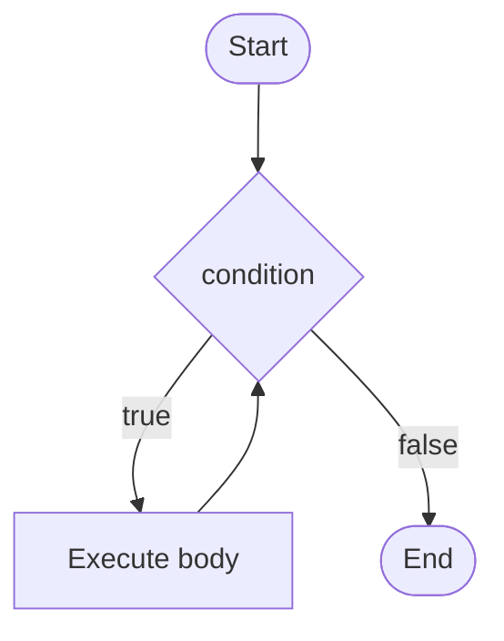
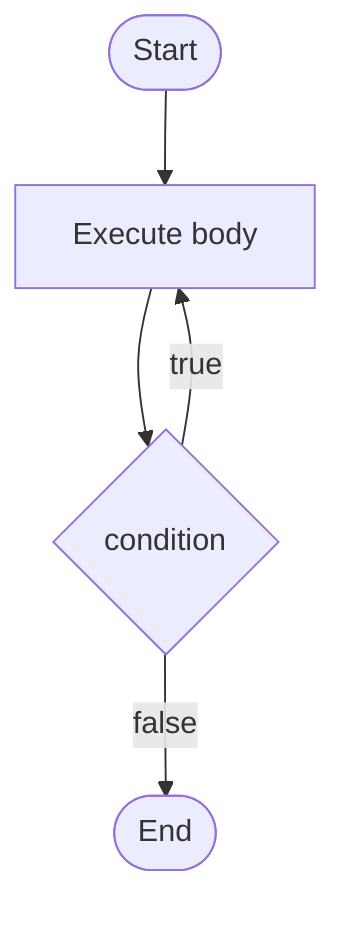

## Table of Contents
- [[#Introduction]]
- [[#1. Conditional Statements]]
  - [[#1.1 `if`, `else if`, `else`]]
  - [[#1.2 `switch` Statement]]
- [[#2. Looping Statements]]
  - [[#2.1 `for` Loop]]
  - [[#2.2 `while` Loop]]
  - [[#2.3 `do-while` Loop]]
  - [[#2.4 Enhanced `for` Loop (for-each)]]
  - [[#2.5 Loop Comparison]]
- [[#3. Branching Statements]]
  - [[#3.1 `break`]]
  - [[#3.2 `continue`]]
  - [[#3.3 `return`]]
- [[#4. Nested Control Structures]]
- [[#5. Summary Table]]
- [[#6. Key Points to Remember]]
- [[#7. Practice Questions]]

---

## Introduction

Control flow determines the order in which statements are executed. Java provides several constructs to alter the linear flow of a program.

---

## 1. Conditional Statements

Conditional statements allow the program to take different paths based on boolean expressions.

### 1.1 `if`, `else if`, `else`



**Diagram 1:** Flow of `if-else if-else` structure.

```java
int score = 85;
if (score >= 90) {
    System.out.println("Grade A");
} else if (score >= 80) {
    System.out.println("Grade B");
} else {
    System.out.println("Grade C");
}
```

### 1.2 `switch` Statement

The `switch` statement selects one of many code blocks to execute.



**Diagram 2:** Flow of `switch` with fall-through.

```java
int day = 3;
switch (day) {
    case 1:
        System.out.println("Monday");
        break;
    case 2:
        System.out.println("Tuesday");
        break;
    case 3:
        System.out.println("Wednesday");
        break;
    default:
        System.out.println("Other day");
}
```

> [!NOTE]  
> **Fall-through:** If you omit `break`, execution continues into the next case. Use it intentionally or always include `break`.

---

## 2. Looping Statements

Loops repeat a block of code while a condition is true.

### 2.1 `for` Loop

```java
for (initialization; condition; update) {
    // body
}
```



**Diagram 3:** Flow of a `for` loop.

```java
for (int i = 0; i < 5; i++) {
    System.out.println("Iteration " + i);
}
```

### 2.2 `while` Loop

```java
while (condition) {
    // body
}
```



**Diagram 4:** Flow of a `while` loop.

```java
int i = 0;
while (i < 5) {
    System.out.println("i = " + i);
    i++;
}
```

### 2.3 `do-while` Loop

```java
do {
    // body
} while (condition);
```



**Diagram 5:** Flow of a `do-while` loop (body executes at least once).

```java
int i = 0;
do {
    System.out.println("i = " + i);
    i++;
} while (i < 5);
```

### 2.4 Enhanced `for` Loop (for-each)

Used to iterate over arrays or collections.

```java
int[] numbers = {1, 2, 3, 4, 5};
for (int num : numbers) {
    System.out.println(num);
}
```

### 2.5 Loop Comparison

| Loop Type     | When to Use                                          | Guaranteed Execution |
| ------------- | ---------------------------------------------------- | -------------------- |
| `for`         | Known number of iterations                           | Condition checked first |
| `while`       | Unknown number of iterations, condition at start     | Condition checked first |
| `do-while`    | At least one execution required                      | Body executes at least once |
| Enhanced `for`| Iterating over arrays/collections (read-only)        | Iterates once per element |

---

## 3. Branching Statements

Branching statements alter the flow inside loops or methods.

### 3.1 `break`

Exits the current loop or switch statement.

```java
for (int i = 0; i < 10; i++) {
    if (i == 5) break;  // loop stops when i reaches 5
    System.out.println(i);
}
```

### 3.2 `continue`

Skips the rest of the current iteration and proceeds to the next.

```java
for (int i = 0; i < 5; i++) {
    if (i == 2) continue; // skips printing when i is 2
    System.out.println(i);
}
```

### 3.3 `return`

Exits from the current method and optionally returns a value.

```java
static int max(int a, int b) {
    if (a > b) return a;
    else return b;
}
```

---

## 4. Nested Control Structures

You can place one control structure inside another.

```java
for (int i = 1; i <= 3; i++) {
    for (int j = 1; j <= 3; j++) {
        System.out.print(i * j + " ");
    }
    System.out.println();
}
```

**Output:**
```
1 2 3 
2 4 6 
3 6 9 
```

> [!CAUTION]  
> Deep nesting can reduce readability. Consider refactoring into separate methods.

---

## 5. Summary Table

| Category       | Constructs                                      |
| -------------- | ----------------------------------------------- |
| Conditional    | `if`, `else if`, `else`, `switch`               |
| Loops          | `for`, `while`, `do-while`, enhanced `for`      |
| Branching      | `break`, `continue`, `return`                   |

---

## 6. Key Points to Remember

- Always use braces `{}` even for single statements to avoid bugs.
- `switch` works with `byte`, `short`, `char`, `int`, `String` (Java 7+), and `enum`.
- Infinite loops: `while(true)` or `for(;;)`.
- `break` and `continue` can be used with labels to break out of nested loops:

```java
outer: for (int i = 0; i < 3; i++) {
    for (int j = 0; j < 3; j++) {
        if (i == 1 && j == 1) break outer;
        System.out.println(i + " " + j);
    }
}
```

> [!TIP]  
> Practice writing small programs using each control structure to build fluency. They are the building blocks of algorithms!

---

## 7. Practice Questions

1. Write a program to check if a number is positive, negative, or zero using `if-else`.
2. Use a `switch` statement to print the name of a month based on its number (1–12).
3. Print the sum of first 10 natural numbers using all three loop types.
4. Create a multiplication table (1 to 5) using nested `for` loops.
5. Write a program that continues to take input until the user enters -1, then prints the sum (using `while`).

---

> [!NOTE]  
> **Previous Module:** [[Intro to java]]  
> **Next Module:** [[Operators in java]]