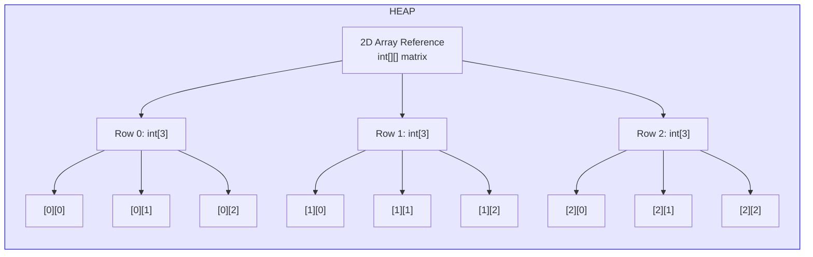
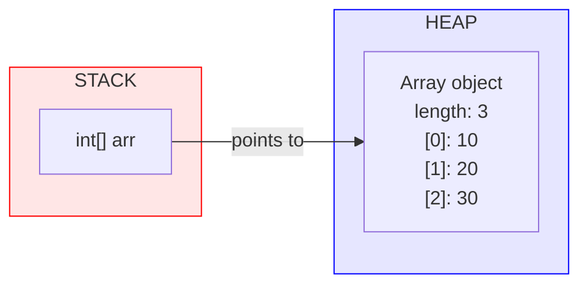

## Table of Contents
- [[#What is an Array]]
- [[#Array Declaration and Creation]]
- [[#Array Initialization]]
- [[#Accessing Array Elements]]
- [[#Array Length]]
- [[#Iterating Over Arrays]]
- [[#The Arrays Utility Class]]
- [[#Multidimensional Arrays]]
- [[#Jagged Arrays]]
- [[#Copying Arrays]]
- [[#Command-Line Arguments]]
- [[#Arrays and Memory]]
- [[#Common Pitfalls and Best Practices]]
- [[#Practice Questions]]
- [[#Summary]]

---

## What is an Array?

An **array** is a container object that holds a fixed number of values of a **single type**. It is a fundamental data structure that stores elements in contiguous memory locations.

- Arrays are **zero-indexed** (first element at index `0`).
- Once created, the size of an array **cannot be changed**.
- Arrays are **objects** in Java, so they are stored in the heap.

> [!NOTE]  
> Arrays can hold both primitive types (`int[]`, `char[]`) and object types (`String[]`, `Integer[]`).

---

## Array Declaration and Creation

### Declaration Syntax
```java
// Preferred style
dataType[] arrayName;

// Also valid (C-style)
dataType arrayName[];
```

Examples:
```java
int[] numbers;       // array of integers
String[] names;      // array of strings
double[] prices;     // array of doubles
```

### Creation (Allocation)
Use the `new` keyword to allocate memory:
```java
arrayName = new dataType[size];
```

Combine declaration and creation:
```java
int[] numbers = new int[5];       // creates array of 5 integers (default 0)
String[] names = new String[3];   // creates array of 3 Strings (default null)
```

> [!TIP]  
> Default values: numeric types → `0`, `boolean` → `false`, `char` → `'\u0000'`, object references → `null`.

---

## Array Initialization

### Static Initialization (at creation)
```java
int[] numbers = {10, 20, 30, 40, 50};
String[] fruits = {"Apple", "Banana", "Orange"};
```

### Dynamic Initialization (after creation)
```java
int[] squares = new int[5];
for (int i = 0; i < squares.length; i++) {
    squares[i] = i * i;
}
```

---

## Accessing Array Elements

Use the index inside square brackets:
```java
int first = numbers[0];   // get first element
numbers[2] = 99;          // set third element
```

> [!CAUTION]  
> Accessing an index outside `0` to `length-1` throws **`ArrayIndexOutOfBoundsException`**.

---

## Array Length

Every array has a `length` field (not a method):
```java
int size = numbers.length;   // returns the number of elements
```

---

## Iterating Over Arrays

### Traditional `for` loop
```java
for (int i = 0; i < numbers.length; i++) {
    System.out.println(numbers[i]);
}
```

### Enhanced `for` loop (for-each)
```java
for (int num : numbers) {
    System.out.println(num);
}
```

> [!TIP]  
| Use for-each when you don't need the index. It's cleaner and avoids off‑by‑one errors.

### Using `while` or `do-while`
```java
int i = 0;
while (i < numbers.length) {
    System.out.println(numbers[i++]);
}
```

---

## The Arrays Utility Class

`java.util.Arrays` provides many useful static methods for array manipulation.

| Method                      | Description                                      |
|-----------------------------|--------------------------------------------------|
| `toString(array)`           | Returns a string representation of the array.    |
| `sort(array)`               | Sorts the array in ascending order.              |
| `binarySearch(array, key)`  | Searches for a key using binary search (array must be sorted). |
| `copyOf(array, newLength)`  | Copies the array (truncates/pads with defaults). |
| `copyOfRange(array, from, to)` | Copies a range.                                 |
| `fill(array, value)`        | Assigns a value to every element.                |
| `equals(array1, array2)`    | Compares two arrays for equality (deep content). |
| `deepToString(Object[])`    | For nested arrays (multidimensional).            |

```java
import java.util.Arrays;

public class ArrayDemo {
    public static void main(String[] args) {
        int[] arr = {5, 2, 8, 1, 9};
        System.out.println(Arrays.toString(arr));   // [5, 2, 8, 1, 9]
        
        Arrays.sort(arr);
        System.out.println(Arrays.toString(arr));   // [1, 2, 5, 8, 9]
        
        int index = Arrays.binarySearch(arr, 5);    // 2
        System.out.println("Index of 5: " + index);
        
        int[] copy = Arrays.copyOf(arr, 3);         // [1, 2, 5]
    }
}
```

---

## Multidimensional Arrays

Java supports arrays of arrays, commonly used for matrices.

### 2D Array Declaration and Creation
```java
int[][] matrix = new int[3][4];   // 3 rows, 4 columns (all default 0)
```

### Static Initialization
```java
int[][] matrix = {
    {1, 2, 3},
    {4, 5, 6},
    {7, 8, 9}
};
```

### Accessing Elements
```java
int value = matrix[1][2];   // row 1, column 2 → 6
matrix[0][0] = 99;
```

### Iterating a 2D Array
```java
for (int i = 0; i < matrix.length; i++) {           // rows
    for (int j = 0; j < matrix[i].length; j++) {   // columns of row i
        System.out.print(matrix[i][j] + " ");
    }
    System.out.println();
}
```

### Visual Representation



**Diagram 1:** Memory layout of a 2D array (array of arrays).

---

## Jagged Arrays

A **jagged array** is a 2D array where rows can have different lengths.

```java
int[][] jagged = new int[3][];      // create rows, but columns unspecified
jagged[0] = new int[2];             // row 0 has 2 columns
jagged[1] = new int[4];             // row 1 has 4 columns
jagged[2] = new int[3];             // row 2 has 3 columns
```

Static initialization of a jagged array:
```java
int[][] jagged = {
    {1, 2},
    {3, 4, 5, 6},
    {7, 8, 9}
};
```

---

## Copying Arrays

### Shallow Copy (reference copy)
```java
int[] a = {1, 2, 3};
int[] b = a;            // both refer to the same array
b[0] = 99;              // changes a[0] as well
```

### Deep Copy (new array with same values)

**Using a loop:**
```java
int[] copy = new int[a.length];
for (int i = 0; i < a.length; i++) {
    copy[i] = a[i];
}
```

**Using `System.arraycopy()`:**
```java
int[] copy = new int[a.length];
System.arraycopy(a, 0, copy, 0, a.length);
```

**Using `Arrays.copyOf()`:**
```java
int[] copy = Arrays.copyOf(a, a.length);   // or a.length + extra space
```

**Using `clone()`:**
```java
int[] copy = a.clone();
```

> [!CAUTION]  
> For multidimensional arrays, these methods perform **shallow copies** of the inner arrays. Use nested loops or `Arrays.copyOf` on each row for a deep copy.

---

## Command-Line Arguments

The `main` method's `String[] args` parameter receives command-line arguments.

```java
public class Echo {
    public static void main(String[] args) {
        for (String arg : args) {
            System.out.println(arg);
        }
    }
}
```

Run:
```bash
java Echo Hello World
```
Output:
```
Hello
World
```

---

## Arrays and Memory

- Array variables are **references** stored in the stack.
- The actual array object (with its elements) is stored in the **heap**.
- For primitive arrays, the heap stores the actual values.
- For object arrays, the heap stores **references** to the objects.



**Diagram 2:** Reference variable pointing to array object in heap.

---

## Common Pitfalls and Best Practices

| Pitfall                          | Consequence                                   | Solution                                      |
|-----------------------------------|-----------------------------------------------|-----------------------------------------------|
| Index out of bounds               | `ArrayIndexOutOfBoundsException`              | Always check `length`, use for‑each when possible |
| Using `==` to compare array content | Compares references, not content               | Use `Arrays.equals()` for 1D, `Arrays.deepEquals()` for nested |
| Assuming array is initialized     | May contain default values (e.g., `null`)     | Initialize explicitly or check for `null`     |
| Modifying array in for‑each       | For‑each variable is a copy (for primitives) or reference (for objects) | Use traditional loop if modification needed   |
| Not handling `null` array         | `NullPointerException` when accessing `length` or elements | Check `array != null` before use              |

> [!TIP]  
> To print an array easily: `System.out.println(Arrays.toString(array));`

---

## Practice Questions

1. Write a method that returns the sum of all elements in an `int` array.
2. Find the maximum and minimum values in an array.
3. Reverse an array in place.
4. Check if two arrays are equal (use `Arrays.equals` and compare with manual loop).
5. Create a 2D array (3×3) and compute the sum of each row.
6. Implement a method that flattens a 2D array into a 1D array.
7. Given an array of integers, move all zeros to the end while preserving the order of non-zero elements.
8. Explain the difference between `int[] arr = new int[5];` and `int[][] arr = new int[3][];`.

---

## Summary

- Arrays store multiple values of the same type in a fixed‑size, zero‑indexed structure.
- Declare with `type[] name`, allocate with `new type[size]`.
- Initialize statically `{...}` or dynamically with loops.
- Access elements via index; length via `.length`.
- Use `java.util.Arrays` for common operations.
- Multidimensional arrays are arrays of arrays; they can be jagged.
- Array variables are references; copying requires care to avoid unintended sharing.
- Command‑line arguments are passed as a `String[]` to `main`.

> [!NOTE]  
> Arrays are the foundation for many data structures and algorithms. Master them thoroughly for DSA success.

---

